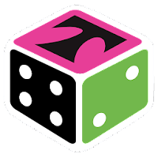
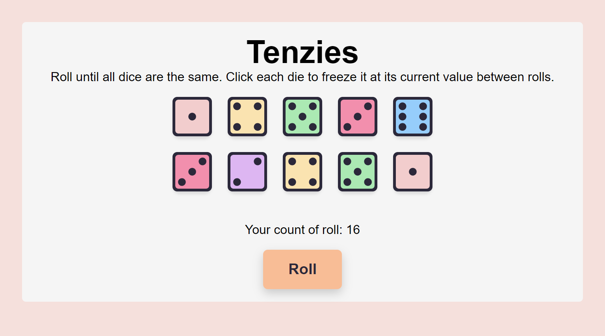
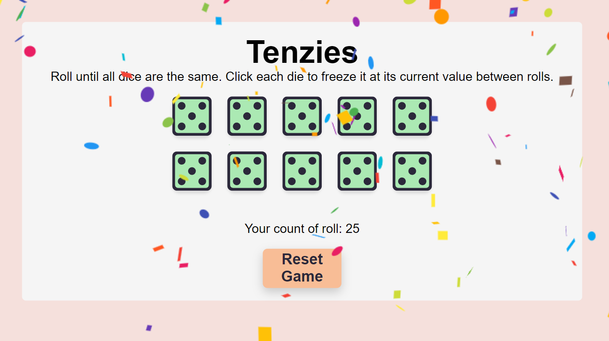

# Tenzies Game App
<h2>About the project</h2>

<b>Tenzies</b> is a captivating dice game designed to offer both fun and challenge to players of all ages. With its simple yet engaging gameplay, Tenzies invites players to roll a set of ten dice, aiming to reach a common number on all faces. The game stands out for its interactive design, allowing players to freeze dice in place with a single click, strategizing over which numbers to keep and which to roll again.  

The game leverages intuitive web technologies to ensure a seamless gaming experience, providing real-time feedback with each roll. Players can track their progress through a roll counter, adding a competitive edge as they seek to achieve their goal in the fewest rolls possible.

<!-- 👉 Live Demo: <a href='https://tenzies-game.app/'>Tenzies Demo</a> -->

<h3>Build with:</h3>

» React JS  
» Vanilla CSS   

 

<h2>Screenshots of the Project 📸</h2>
 
<h3 align='center'>Game Page 🏡</h3>

  

<h3 align='center'>Page during the win 🏆</h3>

